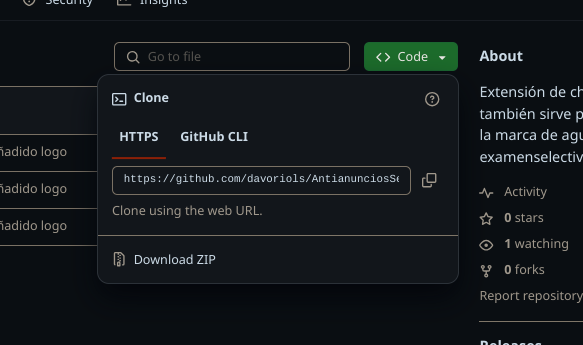
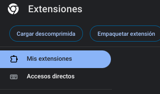
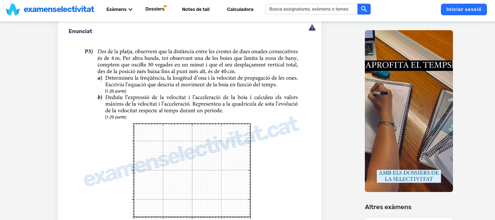
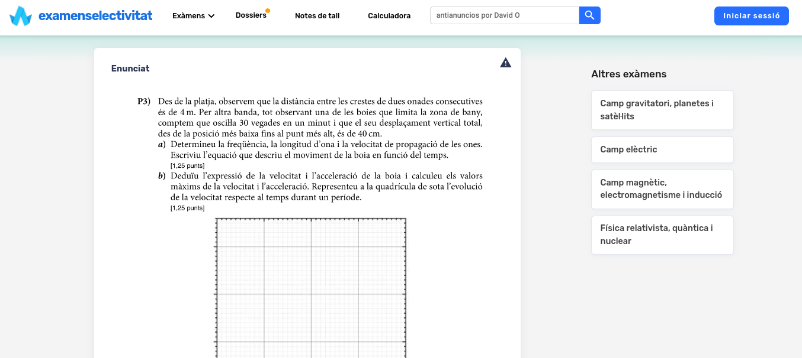

# Antianuncios Selectividad:

Extensión de chrome ( y creo que también sirve para firefox ) que elimina la marca de agua de los exámenes de examenselectivitat.cat y otros anuncios.

# Instalación:

Descarga el zip con el código donde pone Code:

Hay que extraer el fichero zip a una carpeta. 

Abre Chrome y ve a ´chrome://extensions´ y activa el modo de desarrollador arriba a la izquierda: 

Una vez activado, si apretamos ´Cargar descomprimida´ Podemos seleccionar la carpeta que habíamos extraído antes. 

Ahora ya debería funcionar correctamente

# Capturas: 

Antes: 

Después:

